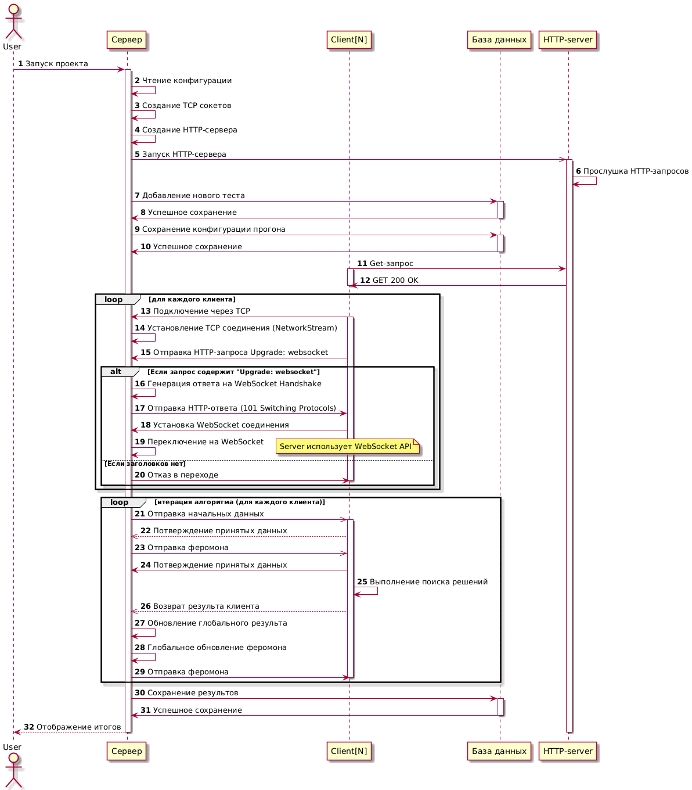

## Распределенный муравьиный алгоритм

Распределенный алгоритм муравьиной колонии. 

По сути каждый клиент работает со своей популяцией муравьев. Сервер глобально обновляет феромон. 
Приложение позволяет создать сервер на C#. Подключиться к серверу с использованием WebSockets через браузер (протестировано в Chrome, в т.ч. на мобильной версии). 

В данной ветке было любопытно протестировать работу WS при использовании JS + C#. Коммуникация клиент-сервер реализовано через **один** порт, в отличии от других веток, где были раздельные порты для ввода данных и для вывода. 

Совместно с WebSocket сервером запускается HTTP сервер. Клиентская часть в папке - *wwwroot*.  


<p><i>Диаграмма последовательности</i></i></p>

Результаты тестов можно посмотреть в БД (testAnts.bd). 
Сервер автоматически заносит данные каждого прогона в БД SQLite.
Для вывода статистики можно использовать скрипт Python(\Analysis\analysis.py)

#### Настройки для сервера:
Конфигурация сервера находится в файле config.json. 
По умолчанию выглядит так:
```JSON
{
    "numClients": 2,
    "maxAnts": 20,
    "inPort": 8081,
    "maxIteration": 200,
    "alpha": 1.0,
    "beta": 5.0,
    "Q": 100,
    "RHO": 0.1,
    "countSubjects": 1000
}
```
Поля отвечают за следующие параметры:

- "numClients": 2 - Количество клиентов;
- "maxAnts": 20 - максимум муравьев(значение разбивается поровну на каждого клиента);
- "inPort": 8081 - порт для подключения клиентов;
- "maxIteration": 200 - максимум итераций для колонии;
- "alpha": 1.0 - Определяет степень влияния феромонов на выбор пути;
- "beta": 5.0 - Определяет степень влияния эвристической информации (например, расстояния, стоимости или других локальных характеристик пути) на выбор;
- "Q": 100 - Константа для обновления феромонов;
- "RHO": 0.1 - Коэффициент испарения феромонов;
- "countSubjects": 1000 - Количество предметов.

